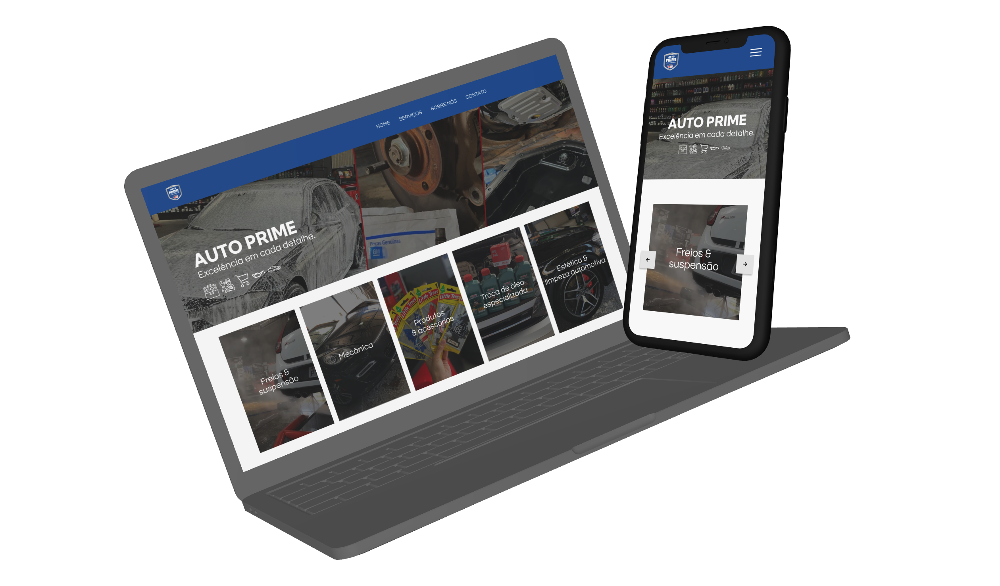

# AutoPrime 🚗
### 
Projeto de Website para empresa AutoPrime Estética e Manutenção
 

 
 
 

---

## Primeira Etapa 14.11.2024 

- 🖥️ Criação do Mockup base para computador.

- ---

## Segunda Etapa 15.11.2024 

- 📱 Criação do Mockup base para computador.

